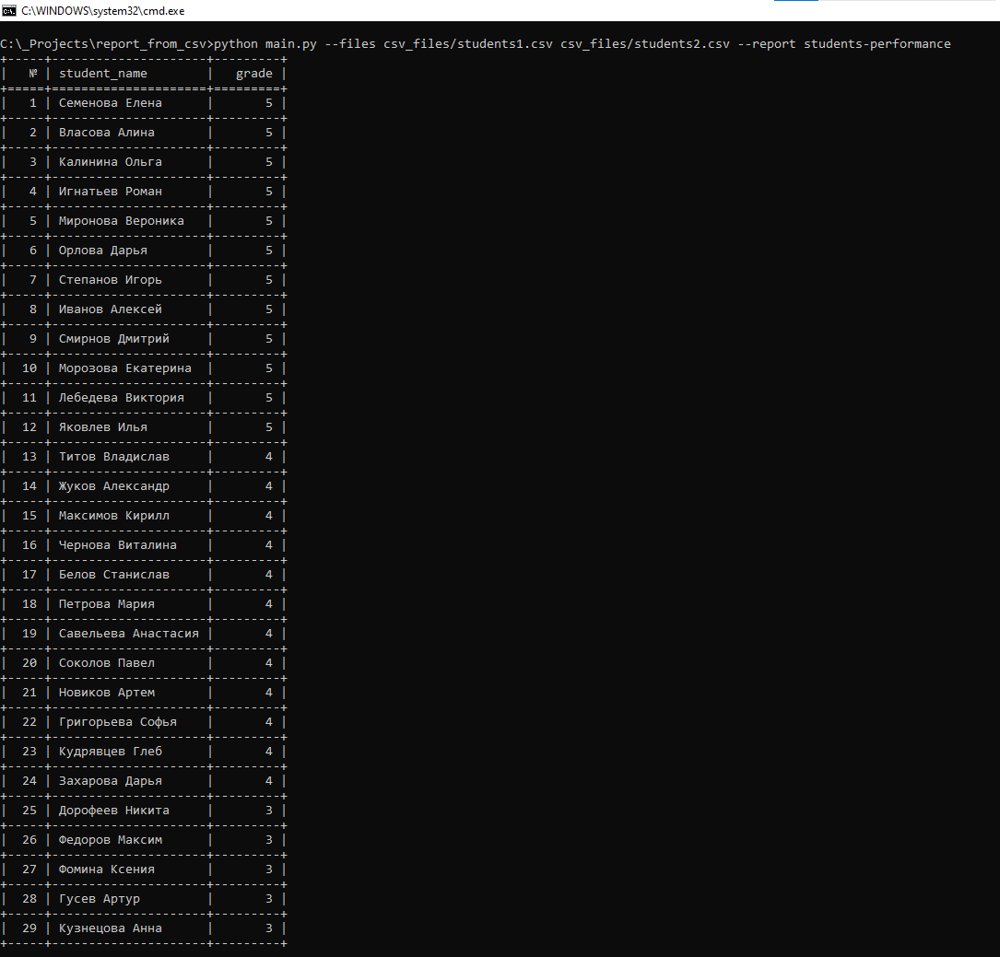

# report_from_csv
Тестовое задание для Workmate

### Чтобы добавить новый отчет, нужно:

* Создать функцию в reports.py

* Добавить запись в словарь REPORTS (словарь в конце файла reports.py)

## Как запустить:

* #### pip install -r requirements.txt

* #### Перейти в корневую директорию проекта

* #### Ввести команду **_**python main.py --files csv_files/students1.csv csv_files/students2.csv --report students-performance**_** 

## Пример запуска команды для создания отчета:

